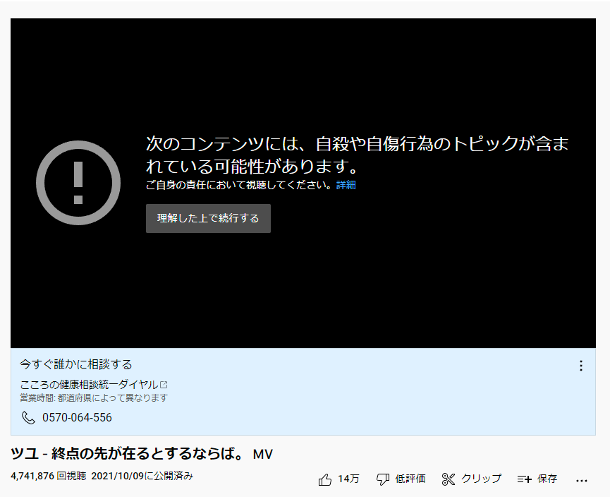

# youtube-alert-blocker

[youtube.com](https://youtube.com/) の 警告を自動で続行する拡張機能です 

自殺や自傷行為に関する表現が含まれているとYouTubeが判断した音楽をYouTubeで聞く際に操作が必要になる事があり、いちいち操作するのが非常に面倒です 
YOASOBIの[夜に駆ける](https://youtu.be/x8VYWazR5mE)やツユの[あの世行きのバスに乗ってさらば。](https://youtu.be/4QXCPuwBz2E)などがこれに該当します 

これのこと

# インストール

[releases](https://github.com/fa0311/youtube-alert-blocker/releases) の manifest_v3.zip を選択してファイルをダウンロード 
Chrome の 拡張機能の管理 を選択して デベロッパーモード を有効にした後、ダウンロードした zip ファイルをページにドラッグしてください

# License

youtube-alert-blocker is under MIT License
